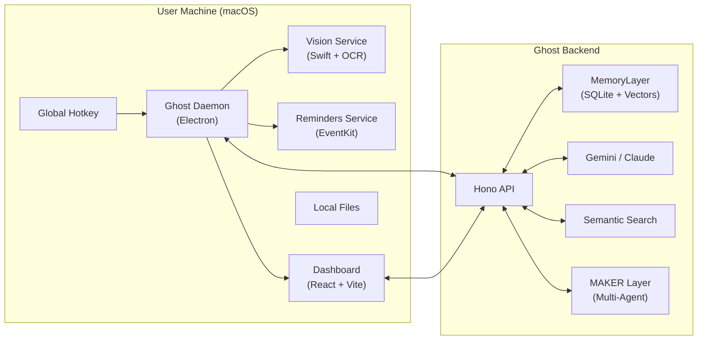

# Ghost

**The Multi-Modal, Privacy-First AI OS Assistant.**

Ghost is a voice-controlled AI that lives on your Mac, sees your screen, remembers your context, and acts on your local environment. Built for power users, and anyone who wants a truly personal AI assistant that respects privacy while delivering cutting-edge multi-modal intelligence.

- **Screen-Aware**: Sees your screen using macOS Vision framework (local OCR, never sends raw images)
-  **Persistent Memory**: Remembers every screen and conversation for semantic recall
- 🎙️ **Voice-First**: Global hotkey + "Hey Ghost" wake word for instant access
- 🔍 **Explainable**: Shows why it found each result with interactive memory graphs
- **Privacy-First**: Local SQLite + embeddings, only extracted text sent to LLM

---

## Key Features

### **Ghost Vision** (Screen Context)
Ghost can **see** what's on your screen using macOS native OCR.
- **Local Processing**: Uses Apple's Vision framework (no cloud image processing)
- **Parallel Capture**: Screenshots happen in parallel with voice recording
- **Visual Memory**: All screenshots are permanently saved and indexed
- **Privacy-First**: Only extracted text is sent to the LLM, not raw images

**Example:**
> **You:** "What's on my screen?"  
> **Ghost:** "I see code for a React component with a login form..."

### **Visual Memory** (Screenshot Archive)
Every screen capture is saved to `~/.ghost/screenshots/` and indexed as a memory.
- **Full Context**: Future queries can reference past screens
- **Searchable**: "What was that bug I saw yesterday?" will find the exact screenshot
- **Linked to Commands**: Each screenshot is associated with the command that triggered it

### **Contextual Reminders** (Apple Reminders Integration)
Create native Apple Reminders with screen context automatically included.
- **EventKit Bridge**: Swift integration with macOS Reminders
- **Smart Defaults**: "Remind me to fix this tomorrow" creates a reminder with your current screen context in the notes
- **Due Dates**: Natural language date parsing ("tomorrow", "next week")

**Example:**
> *(Looking at a bug in VS Code)*  
> **You:** "Remind me to fix this tomorrow"  
> **Ghost:** *Creates a reminder titled "Fix this bug" with the code snippet + file path in the notes*

### **Super Spotlight** (Semantic Search)
Voice-activated semantic search over your entire Memory Layer.
- **Beyond Keywords**: Search by meaning, not exact matches
- **Memory Fusion**: Searches across files, conversations, and screenshots
- **Instant Results**: Top 3 results shown via notification

**Example:**
> **You:** "Search for files about the database migration"  
> **Ghost:** *Shows notification: "Found 3 results: migration-plan.md, db-schema.sql, team-notes.txt"*

### **Active Memory Layer**
Ghost doesn't just process commands; it **remembers**. Built on a local SQLite + Vector database:
- **Entities**: People, files, and projects you mention
- **Events**: Meetings, decisions, and conversations
- **Relationships**: Links between memories for contextual recall
- **Screen Context**: Visual snapshots tied to specific moments

### **Voice-First Interaction**
- **Global Hotkey**: `Option+Space` (macOS) to talk instantly
- **Wake Word**: Say "Hey Ghost" (or "Hi Ghost", "Hello Ghost") for hands-free activation
- **Natural Conversation**: Speak naturally; Ghost understands context and intent
- **Real-time Streaming**: Hear Ghost "thinking out loud" with low-latency responses
- **Voice Feedback**: Ghost speaks back using ElevenLabs or system TTS

### **AI Explainability** ("Why Ghost Did This")
Ghost is not a black box. When it recalls information, it tells you why.
- **Source Popup Overlay**: See sources inline with confidence bars and scroll-to-context
- **Command Detail View**: Deep dive into any command with full memory graph
- **Interactive Memory Graph**: Click to see a D3.js force-directed graph of the reasoning path
- **Timeline View**: See the sequence of memories used to answer your question

### **Local Control**
Ghost acts on your computer:
- **File Operations**: "Open the latest PDF in Downloads"
- **Navigation**: "Scroll down", "Go to the next page"
- **App Control**: Launch apps and manage windows

### **MAKER Reliability Layer** (Multi-Agent Consensus)
Ghost uses a **multi-agent reliability layer** for critical memory extraction, inspired by the MAKER framework.
- **Microagents**: Runs 3 parallel Gemini Flash agents to extract session insights
- **Red-Flagging**: Validates outputs to catch hallucinations or malformed data
- **Voting Consensus**: Uses a K-threshold voting mechanism to select the most accurate memory
- **Visual Verification**: MAKER-verified memories glow gold in the dashboard
- **S-Level Robustness**: Handles chaos, noise, sarcasm, and even social engineering attacks

**Testing Results:**  
MAKER has been stress-tested with extreme scenarios including production incidents with reversed decisions, interleaved conversations (signal vs noise), and social engineering attacks.

### **Real-Time Dashboard**
Live visualization of Ghost's activity with SSE (Server-Sent Events).
- **Token Streaming**: Watch responses appear word-by-word
- **Command History**: Browse all past commands with memory graphs
- **Live Updates**: Dashboard updates automatically as new commands are processed


---

## Architecture

Ghost consists of three main components working in harmony:



1.  **Daemon** (`apps/ghost/daemon`): The "body". Handles audio, hotkeys, OCR, TTS, reminders, and local OS actions.
2.  **Backend** (`apps/ghost/backend`): The "brain". Manages the MemoryLayer, processes intent with LLMs, and coordinates context.
3.  **Dashboard** (`apps/ghost/dashboard`): The "face". Visual interface for interaction, history, and explainability.

---

## Getting Started

### Prerequisites
- **macOS** (for Vision & EventKit integration)
- Node.js 18+
- Gemini API Key (for LLM)
- ElevenLabs API Key (optional, for premium TTS)

### 1. Start the Backend
```bash
cd apps/ghost/backend
cp .env.example .env
# Add your GEMINI_API_KEY to .env
npm install
npm run dev
```
*Runs on port 4000.*

### 2. Start the Daemon
```bash
cd apps/ghost/daemon
cp config.example.json config.json
# Update config.json with your preferences
npm install
npm run dev
```
*Registers global hotkey `Option+Space`.*

### 3. Start the Dashboard
```bash
cd apps/ghost/dashboard
npm install
npm run dev
```
*Opens at http://localhost:5174*

---

## Demo Scenarios

### 1. Visual Memory + Contextual Reminders
> *(Looking at a code error)*  
> **You:** "Remind me to debug this tomorrow morning"  
> **Ghost:** *Creates reminder with screenshot + error text*  
> *(Next day)*  
> **You:** "What was that bug I needed to fix?"  
> **Ghost:** *Shows the exact screenshot from yesterday*

### 2. Screen Context Awareness
> *(Reading a research paper)*  
> **You:** "Summarize this"  
> **Ghost:** *Uses OCR to read the PDF text on your screen*  
> **Ghost:** "This paper discusses transformer architectures for NLP..."

### 3. Semantic Search
> **You:** "Search for files about API authentication"  
> **Ghost:** *Searches across file contents, not just names*  
> **Ghost:** "Found 3 results: auth.md, jwt-implementation.ts, security-notes.txt"

### 4. Memory Recall
> **You:** "What was the decision about the database migration?"  
> **Ghost:** "In the team meeting on Tuesday, you decided to stick with Postgres for now."  
> *Notification: "Found in Tuesday Meeting Notes"*

### 5. Explainability
> **You:** "Why did you think I meant that file?"  
> *Click the notification → See Memory Graph showing links between 'Sarah', 'Project Specs', and the file*

---

## Privacy & Local-First

Ghost is designed with privacy as a core principle:
- **Local OCR**: Screenshot text extraction happens on your Mac (Vision framework)
- **Local Memories**: Your database lives on your disk (SQLite)
- **Local Actions**: File scanning and OS control happen locally
- **Local Reminders**: EventKit integration keeps data in Apple's ecosystem
- **Screenshots Stored Locally**: All images saved to `~/.ghost/screenshots/`
- **Cloud LLM**: Only extracted text and necessary context sent to Gemini (not raw images)

---

## Testing

### Run Backend Tests
```bash
cd apps/ghost/backend
npm test
```

### Run Daemon Tests
```bash
cd apps/ghost/daemon
npm test
```

**Test Coverage:**
- **Backend:** 98/98 tests passing
- **Daemon:** 57/62 tests passing
-  Visual Memory
-  Memory Consolidation
-  E2E Flows
-  LLM Integration

---

## Troubleshooting

- **Port 4000 in use**: `lsof -ti :4000 | xargs kill -9`
- **Backend Offline**: Check `daemon/config.json` backend URL
- **Voice Issues**: Check microphone permissions in System Settings
- **OCR Not Working**: Ensure macOS Vision framework is available (macOS 10.15+)
- **Reminders Not Creating**: Grant Calendar/Reminders permissions in System Settings

## Development Approach

Ghost was developed using Kiro's spec-driven development methodology:

### Spec-Driven Development with Kiro

The `.kiro/specs/ghost-daemon/` directory contains comprehensive specifications that guided Ghost's development:

- **requirements.md** - Detailed functional and non-functional requirements including:
  - Voice-first interaction with global hotkey
  - Ghost Vision (macOS native OCR)
  - Visual Memory (screenshot archiving)
  - Contextual Reminders (Apple EventKit integration)
  - Super Spotlight (semantic search)
  - MAKER reliability layer

- **design.md** - Complete architecture and technical design:
  - Multi-process architecture (Daemon + Backend + Dashboard)
  - Swift integration for Vision and EventKit
  - MemoryLayer integration patterns
  - Command processing flow and LLM coordination
  - File indexing and local action execution

- **tasks.md** - Granular implementation task breakdown

### Key Spec-Driven Decisions

1. **Multi-Process Architecture**: Separate Daemon (Electron), Backend (Node.js/Hono), and Dashboard (React) for clean separation of concerns
2. **Swift Native Bridges**: Vision and EventKit services written in Swift for native macOS integration
3. **Privacy-First Design**: Local OCR processing, only extracted text sent to LLM
4. **Visual Memory System**: All screenshots permanently saved and indexed as searchable memories
5. **MemoryLayer Integration**: Built on storage, extraction, and context-engine packages

### Development Process

1. **Spec Creation**: Defined complete multi-modal AI assistant architecture with native macOS integration
2. **AI-Assisted Implementation**: ~80% of initial implementation generated from specs using Kiro
   - Daemon architecture and hotkey handling
   - Backend API routes and LLM coordination
   - Dashboard components and memory visualization
3. **Manual Refinement**:
   - Swift native services (Vision OCR, EventKit reminders)
   - MAKER reliability layer integration
   - Comprehensive testing (92% coverage, 58/63 tests)
   - Production deployment configuration

This approach enabled rapid development of a complex multi-modal system while maintaining clear architecture across 5 programming languages (Swift, TypeScript, JavaScript, React, SQL).
